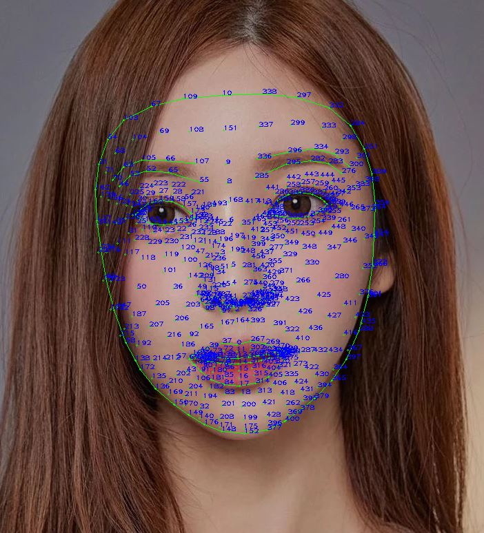

# FASHMESH
### Using Goole MediaPipe's Fasemesh to find eyebrow 
#### just import mediapipe(Free & Open Source) URL :: https://google.github.io/mediapipe/solutions/face_mesh.html

## sample image

## result (+ landmark points number)

